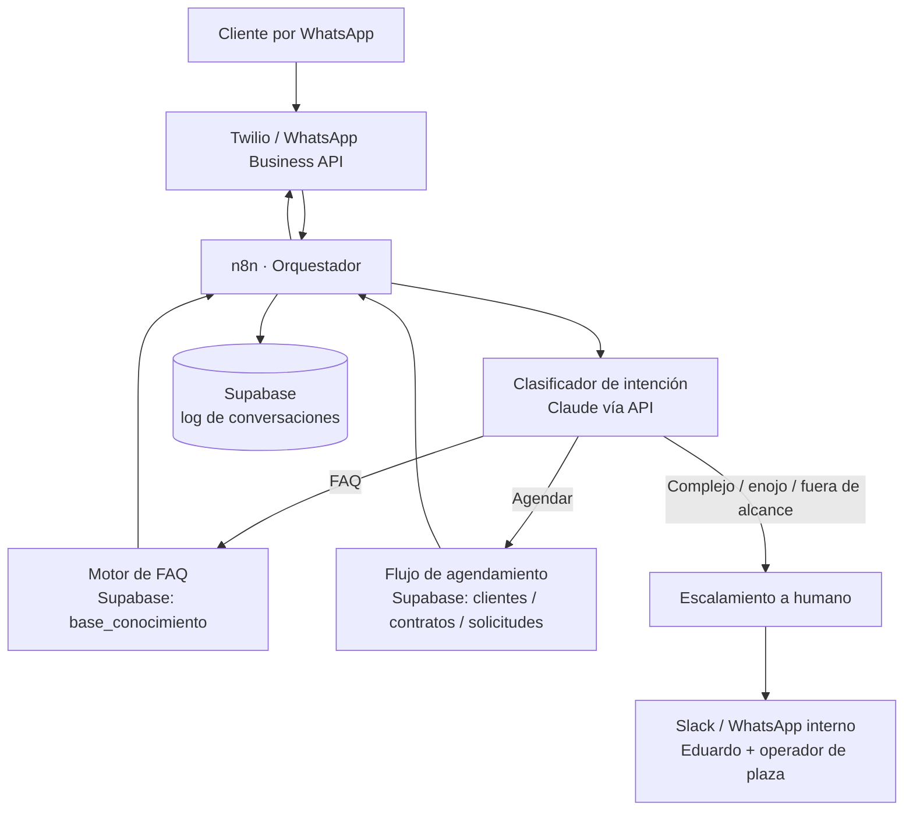

# Chatbot de Atención al Cliente — Grupo Portátil

**Versión:** 1.0 · **Plazas:** Monterrey (MTY) y Querétaro (QRO) · **Canal principal:** WhatsApp Business

Diseño de un asistente automatizado de atención al cliente para GP que resuelve tres funciones:

1. **Responder preguntas frecuentes** (FAQ) sin intervención humana.
2. **Agendar servicios** (cotización, servicio de limpieza/bombeo, entrega, retiro) integrado a Supabase.
3. **Escalar casos complejos** a un agente humano (Eduardo / operador de la plaza) con contexto completo.

---

## OBJETIVO OPERATIVO

**Qué se resuelve:** el equipo hoy atiende manualmente por WhatsApp/Troncalnet cada pregunta de precio, cada solicitud de servicio y cada duda. Esto consume tiempo de Eduardo y operadores, genera respuestas fuera de horario perdidas y retrasa la programación de rutas.

**Indicadores que mejora:**
- **% de conversaciones resueltas sin humano** (meta inicial: ≥ 55% de los mensajes entrantes).
- **Tiempo de primera respuesta** (de minutos/horas a < 5 segundos, 24/7).
- **Solicitudes de servicio capturadas directo en Supabase** (menos recaptura manual, menos servicios perdidos).
- **Tiempo del equipo liberado** para operación de campo en lugar de responder chats repetitivos.

---

## ARQUITECTURA GENERAL



**Componentes y su rol (todo sobre stack existente de GP):**

| Capa | Herramienta | Rol |
|---|---|---|
| Canal | **Twilio + WhatsApp Business / Troncalnet** | Recibe y envía mensajes al cliente |
| Orquestación | **n8n** | Enruta cada mensaje, mantiene el estado de la conversación, llama a los sub-flujos |
| Comprensión | **Claude (API)** | Clasifica intención, extrae datos (plaza, tipo de unidad, fechas), redacta respuestas naturales en español MX |
| Datos | **Supabase** | `clientes`, `contratos`, `solicitudes`, `base_conocimiento`, `conversaciones` |
| Escalamiento | **Slack / WhatsApp interno** | Notifica a Eduardo o al operador de plaza con el contexto de la conversación |
| Facturación | **Facturama** (fase 2) | Genera CFDI cuando se confirma pago anticipado |

**Principio de diseño clave:** el bot **nunca genera una orden de trabajo por sí mismo**. Por el modelo **prepago** de GP, el bot captura la solicitud y la deja en estado `pendiente_pago`; la orden se genera solo cuando `pago_confirmado = TRUE` (regla existente del flujo de contratos).

---

## CAPACIDAD 1 · Responder preguntas frecuentes (FAQ)

### PROCESO / FLUJO

```
Cliente escribe → n8n recibe → Claude clasifica intención = "faq"
  → Claude busca respuesta en base_conocimiento (Supabase)
  → Si confianza alta: responde en lenguaje natural
  → Si confianza baja o pregunta sin match: ofrece opciones o escala
  → Registra la interacción en conversaciones
```

### Catálogo inicial de FAQ (tabla `base_conocimiento`)

| Categoría | Pregunta típica del cliente | Fuente de la respuesta |
|---|---|---|
| Cobertura | "¿Dan servicio en [zona]?" | Reglas por plaza (MTY: Santa Catarina, García, Apodaca, Escobedo… / QRO: El Marqués, Corregidora, Benito Juárez) |
| Precios | "¿Cuánto cuesta rentar un sanitario?" | Tabla `tarifas` en Supabase (estándar / ejecutivo / discapacitados / evento) |
| Tipos de unidad | "¿Qué tipos de baño tienen?" | Catálogo de unidades |
| Modelo de pago | "¿Cómo se paga?" | Prepago / cobro anticipado, mensual o por evento |
| Frecuencia de servicio | "¿Cada cuándo limpian?" | Semanal / quincenal / mensual según contrato |
| Insumos | "¿Incluye papel y gel?" | Según `incluye_insumos` del tipo de contrato |
| Facturación | "¿Dan factura?" | CFDI 4.0 vía Facturama, pedir RFC/uso CFDI |
| Tiempos de entrega | "¿En cuánto entregan?" | Regla operativa por plaza |

### Ejemplo de diálogo

> **Cliente:** hola, cuánto cuesta un baño portátil para una obra en Apodaca por 3 meses
>
> **Bot GP:** ¡Hola! 🟢 Con gusto. Para una obra en **Apodaca (Monterrey)** manejamos sanitarios estándar con servicio de limpieza incluido. Para un contrato de 3 meses aplicaría descuento por duración.
>
> ¿Me confirmas para darte el precio exacto?
> • ¿Cuántas unidades necesitas?
> • ¿Frecuencia de limpieza: semanal o quincenal?
>
> *(El bot arma la cotización con la tabla de tarifas; si el cliente pide cerrar, pasa a la Capacidad 2.)*

**Regla anti-alucinación:** el bot **solo cita precios que existen en la tabla `tarifas`**. Si no hay tarifa cargada para el caso, no inventa: dice "déjame confirmarlo con el equipo" y escala.

---

## CAPACIDAD 2 · Agendar servicios

Cubre tres sub-flujos: **(a) nueva cotización/renta**, **(b) servicio de limpieza para cliente existente**, **(c) entrega o retiro**.

### PROCESO / FLUJO — nueva solicitud

```
Intención = "agendar" → Claude extrae slots requeridos:
  - tipo de solicitud (cotización / servicio / entrega / retiro)
  - plaza (MTY / QRO)  ← se infiere de la dirección
  - tipo y cantidad de unidades
  - dirección del sitio
  - fecha/ventana deseada
  - frecuencia (si es contrato periódico)
  - datos de contacto y facturación (RFC si pide factura)

Faltan slots → el bot pregunta uno a uno (no todo de golpe)
Slots completos → INSERT en Supabase `solicitudes` (estado: pendiente_pago)
  → Notifica a Eduardo/operador de plaza en Slack
  → Confirma al cliente y explica el paso de pago anticipado
```

### Regla de negocio: cobro anticipado

El bot **agenda pero no compromete unidad ni ruta** hasta que exista pago confirmado. El mensaje de cierre es explícito:

> **Bot GP:** ¡Listo! Registré tu solicitud **SOL-MTY-2026-0117**:
> • 3 sanitarios estándar · limpieza semanal · obra en Apodaca
> • Inicio deseado: lunes 10 de agosto
>
> Como manejamos **pago anticipado**, en cuanto confirmemos tu pago programamos la entrega y te asigna operador. Te enviamos los datos de pago y tu cotización formal en un momento. ✅

### Integración con la programación de rutas

La solicitud queda en Supabase con `plaza` y `zona`, de modo que al confirmarse el pago entra al flujo semanal existente de generación de órdenes (n8n, lunes 6:00 AM) y a SimpliRoute para ruteo. El bot es la **capa de captura**; no reemplaza SimpliRoute ni AppSheet.

### Slot para servicio de cliente existente

Si el número de WhatsApp coincide con `clientes.contacto_telefono`, el bot reconoce al cliente, muestra sus contratos activos y permite pedir un **servicio extra** o **reprogramar** una visita — esto sí puede confirmarse sin nuevo pago si el servicio ya está incluido en su contrato vigente.

---

## CAPACIDAD 3 · Escalar a un agente humano

### Reglas de escalamiento (disparadores)

El bot escala **automáticamente** cuando detecta cualquiera de estos:

| Disparador | Ejemplo | A quién escala |
|---|---|---|
| **Queja / molestia** | "llevo 3 días esperando el servicio", lenguaje de enojo | Eduardo + operador de plaza |
| **Incidencia operativa** | unidad dañada, no la retiraron, derrame, taponamiento | Operador de plaza |
| **Fuera de alcance / baja confianza** | pregunta que el bot no entiende tras 2 intentos | Eduardo |
| **Negociación / precio especial** | volumen grande, gobierno, condiciones especiales | Eduardo |
| **Petición explícita** | "quiero hablar con una persona" | Eduardo |
| **Tema de cobranza/factura complejo** | aclaración de pago, nota de crédito | Eduardo |

### PROCESO / FLUJO de handoff

```
Disparador detectado → n8n cambia estado de conversación a "escalado"
  → El bot deja de responder automáticamente en ese hilo (pausa de X horas)
  → Envía a Slack/WhatsApp interno un resumen estructurado:
       • Cliente + teléfono + plaza
       • Contrato activo (si existe)
       • Resumen de la conversación (generado por Claude)
       • Motivo de escalamiento
       • Link al hilo
  → Mensaje al cliente: "Ya avisé a nuestro equipo, en breve te contactan."
  → SLA: si nadie responde en [30 min hábiles], recordatorio a Eduardo
```

### Mensaje al cliente en el handoff

> **Bot GP:** Entiendo, esto lo ve mejor una persona del equipo. Ya le pasé tu caso a **[Eduardo / operador de la plaza]** con todo el contexto. Te contactan en breve por este mismo WhatsApp. 🙌

**Enrutamiento por plaza:** MTY → Alberto/Emmanuel/Meñito según tipo; QRO → Juan Pablo. Negociación/comercial → Eduardo en ambas plazas.

---

## IMPLEMENTACIÓN EN EL STACK DE GP

### Nuevas tablas en Supabase

```sql
-- Base de conocimiento para FAQ
CREATE TABLE base_conocimiento (
  id UUID PRIMARY KEY DEFAULT gen_random_uuid(),
  categoria TEXT NOT NULL,          -- cobertura / precios / pago / servicio / factura ...
  pregunta_ejemplo TEXT NOT NULL,
  respuesta TEXT NOT NULL,
  plaza TEXT,                       -- MTY / QRO / NULL = ambas
  activo BOOLEAN DEFAULT TRUE,
  actualizado_en TIMESTAMPTZ DEFAULT NOW()
);

-- Solicitudes capturadas por el chatbot (previo a contrato)
CREATE TABLE solicitudes (
  id UUID PRIMARY KEY DEFAULT gen_random_uuid(),
  folio TEXT UNIQUE NOT NULL,             -- SOL-MTY-2026-0117
  cliente_id UUID REFERENCES clientes(id),-- NULL si es prospecto nuevo
  telefono TEXT NOT NULL,
  tipo_solicitud TEXT NOT NULL,           -- cotizacion / servicio / entrega / retiro
  plaza TEXT,                             -- MTY / QRO
  zona TEXT,
  direccion TEXT,
  tipo_unidad TEXT,
  cantidad INT,
  frecuencia_servicio TEXT,
  fecha_deseada DATE,
  requiere_factura BOOLEAN DEFAULT FALSE,
  rfc TEXT,
  estado TEXT NOT NULL DEFAULT 'pendiente_pago', -- pendiente_pago / cotizado / convertido / descartado / escalado
  resumen TEXT,
  creado_en TIMESTAMPTZ DEFAULT NOW()
);

-- Log de conversaciones y estado del bot
CREATE TABLE conversaciones (
  id UUID PRIMARY KEY DEFAULT gen_random_uuid(),
  telefono TEXT NOT NULL,
  plaza TEXT,
  estado TEXT NOT NULL DEFAULT 'bot',     -- bot / escalado / cerrado
  ultima_intencion TEXT,
  escalado_a TEXT,                        -- Eduardo / Alberto / Juan Pablo ...
  motivo_escalamiento TEXT,
  mensajes JSONB,                         -- historial resumido
  actualizado_en TIMESTAMPTZ DEFAULT NOW()
);
```

### Flujos n8n

| Workflow | Trigger | Qué hace |
|---|---|---|
| `chatbot-router` | Webhook Twilio (mensaje entrante) | Carga estado de `conversaciones`, llama a Claude para clasificar, enruta a sub-flujo, responde |
| `chatbot-faq` | Llamado por router | Busca en `base_conocimiento`, arma respuesta, controla confianza |
| `chatbot-agendar` | Llamado por router | Extrae slots, INSERT en `solicitudes`, notifica a plaza |
| `chatbot-escalar` | Llamado por router | Cambia estado a `escalado`, arma resumen, envía a Slack/WhatsApp interno, arma SLA |
| `chatbot-sla` | Cron cada 15 min | Revisa escalamientos sin atender > 30 min, recuerda a Eduardo |

### Prompt de sistema (resumen) para Claude

- Rol: asistente de atención de Grupo Portátil, tono cálido y directo, español de México, emoji 🟢 con moderación.
- Reglas duras: nunca inventar precios ni disponibilidad; siempre respetar el modelo prepago; siempre distinguir plaza MTY/QRO; si hay duda, escalar en vez de adivinar.
- Salida estructurada: `{intencion, slots, confianza, requiere_escalamiento, respuesta_cliente}` para que n8n enrute de forma determinista.

---

## RIESGOS OPERATIVOS

| Riesgo | Impacto | Mitigación |
|---|---|---|
| El bot da un precio equivocado | Pérdida de margen o cliente molesto | Precios **solo** desde tabla `tarifas`; sin tarifa → escala |
| Genera expectativa de entrega sin pago | Rompe el modelo prepago | Estado `pendiente_pago` obligatorio; el bot lo dice explícito |
| No detecta enojo y no escala | Cliente se pierde | Umbral conservador: ante la duda, escala |
| Escalamiento sin que nadie conteste | Cliente abandonado | Workflow `chatbot-sla` con recordatorio a Eduardo |
| Confusión de plaza (MTY vs QRO) | Ruta/operador equivocado | Inferir plaza de la dirección y **confirmar** antes de registrar |
| Dependencia de WhatsApp Business API | Caída del canal | Fallback: registrar mensajes y avisar al equipo para atención manual |
| Datos personales / RFC en el chat | Cumplimiento | No exponer datos fiscales en respuestas; guardarlos solo en Supabase |

---

## MÉTRICAS DE ÉXITO

Medir en Supabase / dashboard n8n:

- **Tasa de contención:** % de conversaciones resueltas sin escalar (meta: ≥ 55% mes 1, ≥ 70% mes 3).
- **Solicitudes capturadas por el bot** y **% convertidas a contrato** (con pago confirmado).
- **Tiempo de primera respuesta** (bot) vs. tiempo de atención tras escalamiento (humano).
- **Escalamientos por motivo** (para alimentar nuevas FAQ y reducir escalamientos evitables).
- **CSAT ligero:** al cerrar, el bot pregunta "¿Te ayudé? 👍/👎".

---

## ROADMAP DE IMPLEMENTACIÓN

**Fase 1 — FAQ + captura (2–3 semanas)**
- Cargar `base_conocimiento` y `tarifas` reales.
- Workflows `chatbot-router` + `chatbot-faq` + `chatbot-agendar` (captura en `solicitudes`).
- Escalamiento manual básico a Slack/WhatsApp interno.

**Fase 2 — Escalamiento inteligente + clientes existentes (2 semanas)**
- Reconocimiento de cliente por teléfono contra `clientes`.
- Reglas de escalamiento automáticas + `chatbot-sla`.
- Servicios extra / reprogramación para contratos vigentes.

**Fase 3 — Cierre del ciclo (según prioridad)**
- Integración con Facturama para envío de datos de pago y CFDI.
- Recordatorios proactivos (vencimiento de contrato, pago) reusando alertas n8n existentes.
- Dashboard de métricas.

---

## SIGUIENTE ACCIÓN

**Para Eduardo, esta semana:**
1. **Aprobar el canal:** confirmar si el bot vive sobre el WhatsApp Business actual (Troncalnet/Twilio) o un número nuevo dedicado.
2. **Entregar insumos de contenido:** tabla de tarifas real + 15–20 preguntas frecuentes reales con su respuesta correcta (esto define la calidad del bot desde el día 1).
3. **Definir a quién escala cada tipo de caso** por plaza (validar el enrutamiento propuesto: MTY → Alberto/Emmanuel/Meñito, QRO → Juan Pablo, comercial → Eduardo).

Con esos tres insumos se puede levantar la Fase 1 en n8n + Supabase y hacer una prueba piloto con un grupo pequeño de clientes reales.
